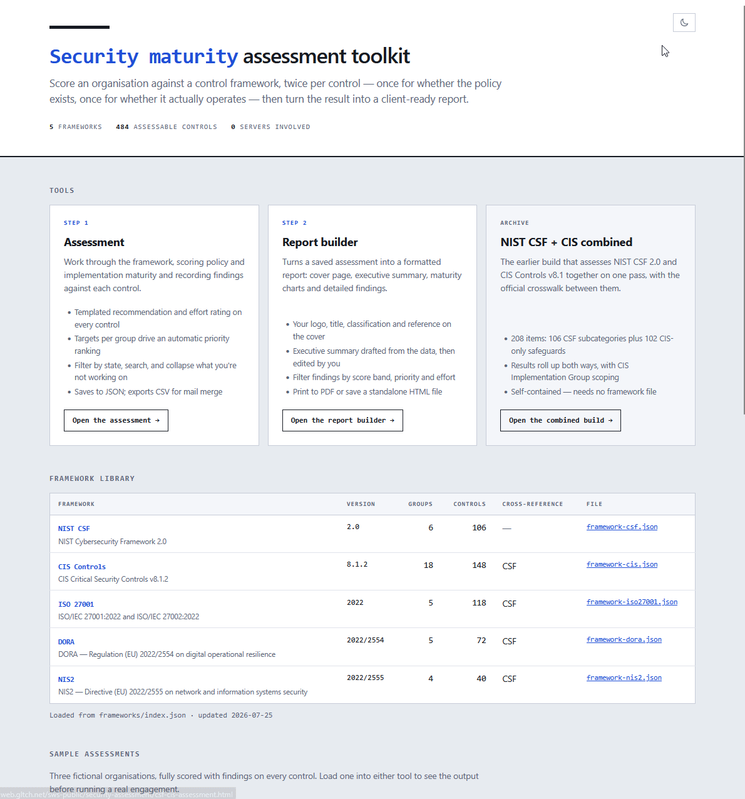

# Security Maturity Assessment Toolkit

A self-contained, static HTML toolkit for running security maturity
assessments against an industry framework, then turning the result into a
client-ready report. No backend, no build step, no accounts — every page is
a single standalone HTML file.



## What it does

- Walks through a control framework question by question, scoring each
  control twice — once for policy, once for implementation — with a
  separate notes box for each.
- Tracks maturity live as you answer, with per-function/category progress
  and a maturity graph.
- Supports six frameworks out of the box: NIST CSF 2.0, CIS Controls v8.1.2,
  ISO/IEC 27001 & 27002:2022, DORA, and NIS2 — or bring your own framework
  JSON.
- Saves and loads assessments as JSON, so you can pause and resume, or run
  the same framework across multiple clients.
- Exports findings to CSV, complete with templated recommendations per
  control so a written report can be built by tailoring the template rather
  than writing findings from scratch.
- Builds a polished client report from a saved assessment: cover page,
  executive summary, maturity graphs, and detailed findings filterable by
  score, priority and effort — printable to PDF or exportable as a
  standalone HTML file.
- Light, dark and terminal themes throughout.

## Layout

    index.html                    homepage, links everything together
    maturity-assessment.html      the assessment tool
    report-builder.html           builds a client report from a saved assessment
    csf-cis-assessment.html       legacy combined NIST CSF + CIS build, self-contained
    frameworks/
        index.json                manifest listing what's in this folder
        framework-csf.json        NIST CSF 2.0                     106 controls
        framework-cis.json        CIS Controls v8.1.2              148 controls
        framework-iso27001.json   ISO/IEC 27001 & 27002:2022       118 controls
        framework-dora.json       DORA (EU) 2022/2554               72 controls
        framework-nis2.json       NIS2 (EU) 2022/2555               40 controls
    demos/
        demo-*.json                six worked examples with findings on every
                                    control, so you can try the report builder
                                    immediately (five linked from the homepage;
                                    demo-csf-cis-kilcarn-foods.json is the matching
                                    demo for the legacy combined build — load it
                                    into csf-cis-assessment.html directly)
    _headers                       Netlify/Cloudflare Pages/Vercel response headers
    .htaccess                      Apache equivalent of _headers

## Running it

Any static file server works. From this folder:

```bash
python3 -m http.server 8000
```

then open <http://localhost:8000/>.

The Framework dropdown lists everything in `frameworks/`. A framework from
anywhere else can still be loaded via "Load from file…".

Opening the HTML files directly from disk (`file://`) also works, but
browsers block directory listing, so the dropdown falls back to the file
picker.

## Adding a framework

Drop the JSON in `frameworks/` and add a row to `index.json`. If
`index.json` is missing, the tools probe the known filenames instead, so a
framework named `framework-<id>.json` is picked up either way.

Framework files use `"schema": 3`: groups containing sections containing
controls, a flat `items` list carrying the question, recommendation and
effort rating, and an optional `references` block for cross-referencing
another standard. Copy an existing file to see the shape.

## Reports

`report-builder.html` reads an assessment JSON. If it was saved from the
assessment tool it's self-contained; otherwise the builder fetches the
matching framework from `frameworks/` automatically. Findings can be
filtered by score band, priority and effort, then printed to PDF or saved
as a standalone HTML file.

## Architecture notes

Assessment data is read from and written to files you choose. Nothing is
uploaded, there's no backend, and there's no storage of any kind — no
cookies, no localStorage, no IndexedDB. Closing the tab loses unsaved work,
which is why the tool warns you on exit.

The only outbound requests are for the framework files in this folder and,
if you set one on a report cover, the logo image from whatever host you
point at. Logo requests carry `referrerpolicy="no-referrer"` so the report
host isn't leaked to the logo's server.

### Response headers

Each HTML file carries its own `Content-Security-Policy` and `Referrer-Policy`
via `<meta>` tags, so the policy travels with the page on any static host —
`default-src 'none'`, inline-only script/style (there's no external script
or style host to allow, since everything is inline), `img-src https: data:
blob:` for report logos, and `connect-src 'self'` for the framework fetches.

A few headers can't be set from HTML — `X-Content-Type-Options`,
`Permissions-Policy`, `Strict-Transport-Security`, and `frame-ancestors`
(browsers ignore `frame-ancestors` in a `<meta>` tag). `_headers` (Netlify,
Cloudflare Pages, Vercel) and `.htaccess` (Apache) in this repo set all of
these, including serving `.json` as `application/json`. If your host reads
neither format, carry the same values over to its config.

### Handling of untrusted input

Framework files, assessment files and report settings files are all
untrusted input — anyone can hand you one. The tools treat them that way:

- All file-derived text is HTML-escaped before it reaches the DOM. Files
  carrying `<script>`, `` or attribute-breakout payloads
  render as literal text.
- URLs out of a framework file, and the report logo URL, are parsed and
  rejected unless `http`/`https`, so `javascript:` and `data:` payloads
  can't reach an attribute. A rejected framework link degrades to plain
  text rather than a link.
- Lookup maps built from file data use null prototypes, and object merges
  skip `__proto__`, `constructor` and `prototype`, so a crafted key can't
  walk the prototype chain or resolve to an inherited property.
- Framework ids and filenames are restricted to `[A-Za-z0-9._-]` with no
  `..` before being used to build a fetch path.
- CSV cells beginning `=`, `+`, `-`, `@` or a control character are prefixed
  with an apostrophe, so free-text findings can't become formulas when the
  export is opened in Excel.
- External links carry `rel="noopener noreferrer"`; there are no inline
  event handlers anywhere, so a strict CSP that forbids them won't break
  anything.
- No `eval`, no `new Function`, no `document.write`, no remote scripts,
  styles or fonts.

One risk no code change removes: a framework file defines the questions you
ask and the recommendations you read. Only load framework files from a
source you trust, the same as any other professional reference.

## A note on the framework content

NIST CSF and CIS content, and the crosswalk between them, are derived from
the published source workbooks. The CIS framework's cross-references to
NIST CSF are CIS's own published mapping (24 June 2024) rather than an
independent interpretation — the relationship reads from the safeguard to
the subcategory, so Subset means the safeguard is narrower than the CSF
outcome.

ISO 27001/27002, DORA and NIS2 content was written from the standards
themselves, and the cross-references to NIST CSF on those three are
indicative rather than accredited mappings.

Check anything client-facing against your own copy of the standard before an
engagement, particularly the ISO clause decomposition, where practitioners
differ on granularity. The recommendations are starting points to tailor,
not advice to issue unchanged.
